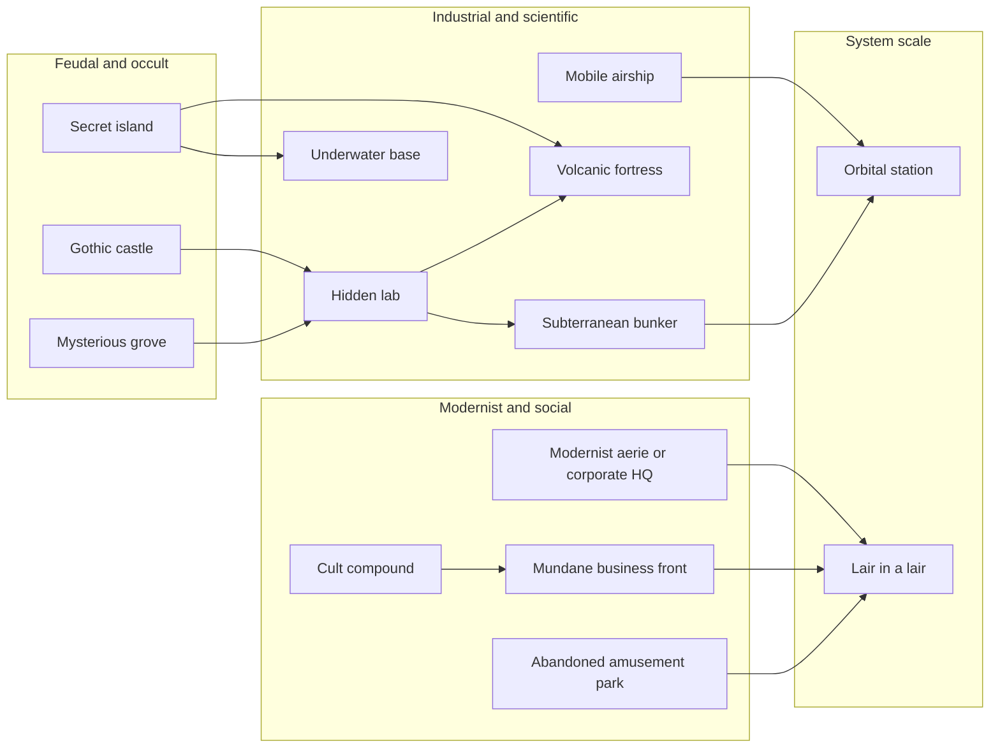

# Villain Lairs As Narrative Architecture

## Executive Summary

Across fiction, the villain lair is not just a backdrop. It is a machine for turning ideology into space. Early lairs externalize feudal power and forbidden inheritance through castles, towers, and cursed landscapes; industrial and scientific lairs shift that logic into locked workshops, bunkers, islands, submarines, and volcanoes; modern thrillers then relocate villainy into sleek modernist houses, corporate compounds, cult territories, and system-scale megastructures such as orbital battle stations. What changes is the shell. What remains stable is the grammar: separation from public law, asymmetry of knowledge, choreographed access, symbolic control over height/depth, and some private sanctum nested inside a larger shell. citeturn6view0turn17view0turn19view0turn22view0turn24view0turn38view0turn42view0turn4view0turn16view1turn16view2turn15view0turn27view2

The most durable archetypes are the gothic castle, subterranean bunker, volcanic fortress, secret island, underwater base, orbital station, mobile airship, hidden lab, modernist aerie, cult compound, mundane-front lair, liminal wilderness site, and the cross-cutting “lair-in-a-lair” pattern. Each archetype solves the same storytelling problems in different ways: how to hide the antagonist, how to dramatize their power, how to visualize their worldview, and how to force the protagonist through a sequence of thresholds that culminates in revelation, confrontation, or contamination. citeturn38view0turn42view0turn4view0turn16view2turn29view3turn31view0

Design-wise, the strongest lairs are rarely defined by scale alone. They become memorable when they combine macro-symbolism with a petty human cruelty: the castle with a “guest” room that is really a cell, the bunker whose meeting table is also a dominance device, the corporate aerie that makes visitors smaller through glazing and elevation, or the barber shop whose back parlour is ordinary enough to make the trapdoor worse. Those petty details are what convert “cool set” into “specific villain habitat.” citeturn18view1turn42view0turn38view0turn31view2

## Scope And Method

This report catalogs lair archetypes requested by the user; unspecified additional constraints are **none**. The evidence base prioritizes primary or official sources where public access exists: Project Gutenberg texts for *Dracula*, *Frankenstein*, H. G. Wells, Jules Verne, and Rymer; official franchise pages for *Star Wars*, *Far Cry 5*, and *BioShock*; and secondary-but-reputable film/design analysis from *Architectural Digest* and *Vanity Fair* where modern production-design documentation is otherwise scattered or non-public. citeturn6view0turn17view0turn17view3turn22view0turn24view0turn28view0turn30view0turn4view0turn16view1turn16view2turn15view0turn27view2turn38view0turn42view0

Two in-conversation creative sketches were treated as **supplemental style cues rather than research evidence**: one about the “sealed command floor” subtype and one about the “smart-home lair” variant. They help explain the user’s preferred tonal register, but they are not canonical sources for genre history. fileciteturn0file0 fileciteturn0file1

The governing analytical heuristic is rigorous but simple: every lair is evaluated by six functions—architectural features, defenses, access/egress, signature petty atrocity, narrative role, and tonal range—plus at least one representative work. Where the public primary-source record for a subtype was thin in the retrieved corpus, I flag that limitation rather than pretending certainty. citeturn38view0turn42view0turn41academia6

## Archetype Catalog

**Gothic castle.** The classic lair is old stone on remote height: hard to map, harder to leave, vertically layered, and already carrying the weight of dead lineages before the villain even steps onstage. In *Dracula*, Jonathan Harker enters a Carpathian landscape he cannot precisely map and arrives at a castle already saturated with local fear, ritual warning, and asymmetrical hospitality. Architecturally, the type favors towers, galleries, crypts, barred rooms, and long sightlines that turn “guesthood” into entrapment. Defenses are remoteness, local superstition, servants who know more than they say, and the structure’s own age. Access is by invitation, carriage road, bridge, or cliff approach; egress is compromised by hidden routes and locked chambers. Signature petty atrocity: the host insists on courtesy while narrowing your usable space down to a single room. Narrative function: to materialize corrupted nobility, contamination by inheritance, and predation masked as etiquette. Tonal variants range from sublime romance to predatory horror. Representative anchor: *Dracula*. citeturn6view0turn12search4turn38view0

**Subterranean bunker and war room.** The bunker turns fear into logistics: reinforced depth, no windows, redundancy, and a command center built around surveillance, communication, and authorization. In *Dr. Strangelove*, Ken Adam’s War Room is a triangular underground chamber with concrete walls, a dramatic slanted ceiling, and a single dominant circular table under a round light, collapsing military planning, ritual theater, and doom management into one room. Defenses are secrecy, blast protection, compartmentalization, and controlled vertical circulation through guarded shafts and elevators. Access is tightly procedural; egress is constrained by the same systems that keep the place safe. Signature petty atrocity: everyone performs hierarchy even when the world is ending—where you sit, who speaks first, who touches the map. Narrative function: to spatialize paranoia, technocracy, and the illusion that catastrophe can be managed from a sealed interior. Tonally it can be satirical, tragic, or coldly procedural. Representative screen anchors: *Dr. Strangelove* and the many later control-bunker descendants it inspired. citeturn42view0turn38view0

**Volcanic fortress.** This subtype fuses geology with spectacle. It uses lava, crater imagery, geothermal danger, and the fantasy of a natural shell hiding engineered interiors. In *You Only Live Twice*, Blofeld’s lair inside an extinct Japanese volcano includes a retractable launch roof, a monorail/industrial interior, and even a piranha pool—an unusually pure supervillain synthesis of megaproject engineering and ceremonial cruelty. Jules Verne’s Back Cup in *Facing the Flag* deepens the model: the “volcano” is a false natural threat, with artificial smoke and detonations used to frighten locals away from a hidden cavern-colony inside the island. Defenses are environmental hazard, secrecy, and topographical misdirection. Access is usually by tunnel, concealed shaft, crater lip, or submarine passage; egress fails the moment the lair’s self-destruct logic activates. Signature petty atrocity: a hazard that is needlessly theatrical because the villain wants every visitor to understand that even the geology is now curated. Narrative function: to stage domination as mastery over the earth itself. Tonal variants run from camp spectacle to techno-horror. Representative examples: *You Only Live Twice* and *Facing the Flag*. citeturn42view0turn29view3turn29view2

**Secret island.** Islands are perfect lair forms because they are naturally juridical fantasies: offshore, bounded, surveillable, and plausibly deniable. In *The Island of Doctor Moreau*, the island compound is a locked enclosure on a lonely volcanic island, partly coral and pumiceous lava, with gates, laboratory spaces, and a “House of Pain” set apart from ordinary moral scrutiny. In *Facing the Flag*, Back Cup is a hidden island-colony whose access depends on a submerged tunnel and a concealed western creek. Defenses are separation, nautical control, and limited landing points. Access is by boat, tug, seaplane, or secret tunnel; egress is impossible without ships, tides, or insider knowledge. Signature petty atrocity: arrivals are never told the full map, because uncertainty is itself a control mechanism. Narrative function: to remove the antagonist from ordinary law and let sovereignty become personal, experimental, or piratical. Tonally, the island can be colonial gothic, pirate-romance, mad-science, or tropical camp. Representative examples: *The Island of Doctor Moreau* and *Facing the Flag*. citeturn19view0turn18view3turn18view4turn18view5turn29view3turn29view4

**Underwater base and submerged city.** The underwater lair literalizes estrangement. It places the villain beneath the ordinary world, inside a pressure-maintained environment whose walls are all that separate mastery from drowning. Verne’s *Nautilus* is the prototype: electrically powered, double-shelled, mobile, self-sufficient, and furnished with private chambers, saloons, treasure storage, and systems that make the sea both barrier and home. *BioShock*’s official framing of Rapture as a “city beneath the sea” in the ruins of a utopian project preserves the same logic at urban scale, while Bond’s Atlantis extends it into production-design opulence. Defenses are pressure, isolation, difficult docking, and dependency on specialized vehicles. Access is by submarine, diving suit, moon pool, or hidden dock; egress depends on maintained systems. Signature petty atrocity: the villain still enforces drawing-room manners in a structure whose baseline condition is existential hazard. Narrative function: to create a womb/tomb space for utopian delusion, secession, obsession, or anti-human purity. Tonal variants include retrofuturism, nautical melancholy, and abyssal horror. Representative examples: *Twenty Thousand Leagues Under the Sea*, *BioShock*, and *The Spy Who Loved Me*’s Atlantis. citeturn25view3turn25view0turn27view2turn42view0

**Orbital station and planet-killer.** The orbital lair is the endpoint of bunker logic: command space untethered from geography, supported by docking infrastructure, life support, and weapons of strategic or planetary scale. The *Star Wars* official databank describes the Death Star as a moon-sized station able to destroy an entire planet, the second Death Star as an incomplete-but-operational strategic trap, and Starkiller Base as an entire planet repurposed into a system-killing superweapon that harvests stellar energy. Defenses are distance, fighters, shields, militarized corridors, and vast internal scale. Access is by shuttle, hangar, or sabotage route; egress often requires timed flight through engineered vulnerable space. Signature petty atrocity: even at civilization-ending scale, the environment still demands uniforms, checkpoint theater, and obedience to tiny procedural humiliations. Narrative function: to make empire legible as architecture—totalizing, extractive, and convinced of its own permanence. Tonal variants range from military opera to apocalyptic techno-horror. Representative examples: the Death Star, Death Star II, and Starkiller Base. citeturn4view0turn16view1turn16view2

**Mobile airship and roaming fortress.** The roaming lair solves a different problem: how to make the villain hard to pin down while still preserving the theatrical unity of a “home.” In *Robur the Conqueror*, the *Albatross* is described as a ship-like platform one hundred feet long with engine spaces below, protective bulwarks, deck-houses used as cabins or machine rooms, and propulsive systems that make the craft both transport and citadel. Mobility itself becomes defense: altitude, speed, changing borders, and the ability to transform any sky into the villain’s jurisdiction. Access is by boarding, kidnapping, tether, or aerial docking; egress from altitude is usually suicidal. Signature petty atrocity: the whole crew lives by the principal’s route plan, including meals, sleep, and weather. Narrative function: to grant omnipresence, unpredictable reappearance, and a sovereign point of view over nations below. Tonally the type can be swashbuckling, imperial, or authoritarian-utopian. Representative anchor: *Robur the Conqueror*’s *Albatross*. citeturn23view1turn23view4turn22view0

**Hidden lab.** The hidden laboratory is the purest “forbidden workroom” archetype. Mary Shelley’s Victor Frankenstein keeps his workshop in a solitary chamber “or rather cell” at the top of the house, separated by gallery and staircase, stocked from charnel-house, dissecting room, and slaughter-house, and culminating in the creature’s animation on a “dreary night of November.” H. G. Wells gives the form its colonial-island mutation in Moreau’s locked enclosure and laboratory, where antiseptic odors, vivisection, and the “House of Pain” create a compound of secrecy, experiment, and moral insulation. Defenses are privacy, technical exclusivity, and the social difficulty of proving what is happening inside. Access is by invitation, apprenticeship, captivity, or trespass; egress is complicated by contamination, guilt, and witnesses. Signature petty atrocity: the workspace is organized with chilling professionalism—as if atrocity were simply research administration. Narrative function: to stage transgression against body, species, or nature. Tonal variants range from tragic hubris to gross-out body horror. Representative examples: *Frankenstein* and *The Island of Doctor Moreau*. citeturn18view1turn18view0turn19view0turn18view3turn18view5

**Modernist aerie, penthouse, and corporate HQ.** Mid- and late-20th-century cinema shifts villainy from rot to polish. According to *Vanity Fair*, Hitchcock’s Vandamm House in *North by Northwest* effectively changed the screen language of villain architecture by relocating danger into sleek modernism: stone, wood, and glass; asymmetrical plans; compressed entry; expansive transparent living areas; long driveways; and elevated sites associated with visual domination and panoptic control. *Architectural Digest* tracks the same lineage through Lautner houses, *Body Double*, the austere retreat in *The Ghost Writer*, and the monumental wood-rich Wallace Headquarters in *Blade Runner 2049*. Defenses here are privacy, wealth, legal insulation, elevation, glazing used one-way in practice, and outsourced security. Access is by gatehouse, elevator, scripted reception sequence, or executive invitation; egress is often socially rather than physically constrained. Signature petty atrocity: every piece of furniture has been arranged to make guests feel provisional in someone else’s brand. Narrative function: to show malice that has gone respectable—capitalized, cultured, and immeasurably hard to prosecute. Tonal variants include cool thriller, corporate dystopia, and techno-horror. Representative examples: Vandamm House, Wallace Headquarters, the Elrod House in *Diamonds Are Forever*, and the lair-house in *The Ghost Writer*. citeturn38view0turn42view0

**Cult compound.** The cult compound differs from the modernist aerie because it weaponizes community itself. The official *Far Cry 5* page frames Hope County as territory threatened by the Project at Eden’s Gate, while secondary plot summaries make clear that Joseph Seed’s rule operates through churches, ranches, armed followers, and coercive labor/indoctrination zones. Architecturally, the cult compound uses familiar forms—church, farmhouse, silo, dormitory, retreat center, workshop—and turns them into concentric systems of spiritual obligation and paramilitary control. Defenses are not only guns and fences but fervor, belonging, and social capture. Access is by road, invitation, or forced induction; egress requires deprogramming as much as escape. Signature petty atrocity: every sign, sermon, or hand-painted motto sounds nurturing while stripping autonomy. Narrative function: to show how lairs scale sideways into society rather than upward into towers. Tonal variants range from tragic commune to siege thriller. Representative example: *Far Cry 5*. citeturn15view0turn43search2

**Abandoned amusement park and corrupted leisure zone.** This is a derived subtype rather than the best-documented canonical one in the retrieved source set, but it is still too important to omit. Its power comes from arrested animation: rides that no longer move, mascots without audiences, queue lines without pleasure, and a built environment designed for joy that now reads as liminal, eerie, or hostile. Secondary sources on abandoned amusement parks and liminal-space aesthetics identify derelict rides, empty transitional spaces, and the stripping away of normal social context as central to why such places feel uncanny. Defenses are maze-like circulation, height, debris, and the player/viewer’s own misreading of play-space as safe-space. Access is usually by broken fence, service road, or night trespass; egress is disorientation. Signature petty atrocity: the prize booth is still locked, long after the economy that justified it has died. Narrative function: to invert childhood scripts and turn leisure into rot. Tonal variants range from comic-grotesque to slasher-surreal. Because official/public primary documentation for specific canonical villain-park lairs was thin in the source set I retrieved, this archetype should be treated as a high-confidence visual grammar with a lower-confidence canon anchor. citeturn40search2turn41search3turn39news0

**Mysterious grove and liminal wild sanctuary.** Not every villain habitat is a building. Some are thresholds in landscape: blasted heaths, cursed clearings, groves, standing-stone circles, or fog-heavy margins where prophecy becomes spatial. *Macbeth* begins with the Weird Sisters on a “desert place” and then on the heath, making villain-adjacent power emerge from weather, waste ground, and ritual recurrence rather than masonry; the later cavern-and-cauldron logic extends that same threshold quality into an interior of occult concentration. Contemporary liminality research is useful here: spaces feel transformative or unsettling when they suspend ordinary rules and identity markers. Defenses are taboo, misdirection, terrain, weather, and the uncertainty of whether one was invited, summoned, or merely lost. Access is by wandering, ritual crossing, or omen; egress often leaves a stain. Signature petty atrocity: the landscape never allows a clean, dignified entrance or exit. Narrative function: to announce fate, corruption, or pact without yet stabilizing power into walls. Tonal variants run from pagan dread to fairy-tale menace. Representative anchor: *Macbeth*. citeturn11view0turn11view1turn41academia6

**Mundane business front.** This subtype is especially potent because it hides evil behind ordinary service exchange. In *The String of Pearls*, Sweeney Todd’s Fleet Street barber shop is outwardly banal—signage, chair, back parlour, customer flow—but it conceals trapdoors, cellars, and underground passages linking shop, vaults, and pie-production spaces. The architecture is not grand; it is profitable. Defenses are normalcy, throughput, and the victim’s willingness to accept routine hospitality. Access is the same as any regular business transaction; egress fails only after a corridor, chair, table, or door proves to be part of a killing mechanism. Signature petty atrocity: wages, tips, and customer expectations are all folded into the machinery of disposal. Narrative function: to insist that the most frightening lairs may be the ones integrated into daily commerce. Tonal variants range from penny-dreadful grotesque to black comedy. Representative anchor: *The String of Pearls*. citeturn30view0turn31view0turn31view2turn31view3

**Lair-in-a-lair and sealed command floor.** This is less a standalone genre shell than a recurrent internal structure. The most durable lairs hide a second lair inside themselves: Back Cup’s individual grottoes and technical chambers nested within a fake volcano-island; Sweeney Todd’s back parlour and cellar-trap network beneath the shopfront; the Death Star II’s command logic nested inside a megastructure; the modernist villain house whose entry compresses the visitor before releasing them into a surveillance-rich glass overlook. The sanctum is the place where the lair stops being logistics and becomes biography. Defenses are secrecy, misleading circulation, keyed access, and the fact that henchmen themselves usually know only fragments. Access requires progressing through false centers; egress is often cut off once the true sanctum is entered. Signature petty atrocity: only the principal knows which room is ceremonial, which one is functional, and which one is a kill-box. Narrative function: to escalate revelation and give the final confrontation a feeling of entering the villain’s private mind rather than merely their property. citeturn29view3turn31view2turn16view2turn38view0

## Comparative Matrix

| Name | Scale | Mobility | Visibility | Defenses | Symbolic meaning | Best genres | Example works |
|---|---|---|---|---|---|---|---|
| Gothic castle | Building to estate | Fixed | High silhouette, remote siting | Height, stone, superstition, locked chambers | Corrupted inheritance | Gothic horror, dark fantasy | *Dracula* citeturn6view0turn12search4 |
| Subterranean bunker / war room | Building core to complex | Fixed | Low outside, high inside | Reinforcement, secrecy, controlled circulation | Paranoia and command | Satire, military thriller | *Dr. Strangelove* citeturn42view0 |
| Volcanic fortress | Building to megacomplex | Fixed | Hidden shell, spectacular reveal | Geography, heat, tunnels, self-destruct logic | Hubris over nature | Spy spectacle, techno-horror | *You Only Live Twice*; *Facing the Flag* citeturn42view0turn29view3 |
| Secret island | Island colony | Fixed but isolated | Hidden by distance | Coastline control, tunnel/dock monopoly | Personal sovereignty | Adventure, piracy, mad science | *The Island of Doctor Moreau*; *Facing the Flag* citeturn19view0turn29view4 |
| Underwater base / submerged city | Vessel to city | Semi-mobile or fixed | Invisible from land | Pressure, docking difficulty, environmental hazard | Secession from humanity | Retrofuturism, abyssal horror | *Twenty Thousand Leagues Under the Sea*; *BioShock*; Atlantis in *The Spy Who Loved Me* citeturn25view3turn27view2turn42view0 |
| Orbital station / planet-killer | Megastructure to planetary | Mobile in space or fixed orbital role | Spectacularly visible | Fighters, shields, scale, airlocks | Total empire and extractive reach | Space opera, apocalypse | Death Star, Death Star II, Starkiller Base citeturn4view0turn16view1turn16view2 |
| Mobile airship / roaming fortress | Vehicle-complex | High | High but transient | Altitude, speed, rerouting | Omnipresence | Adventure SF, imperial fantasy | *Robur the Conqueror* citeturn22view0turn23view1 |
| Hidden lab | Room to compound | Usually fixed | Low | Secrecy, technical exclusivity, moral insulation | Transgression against body/nature | Science horror, tragedy | *Frankenstein*; *The Island of Doctor Moreau* citeturn18view1turn18view0turn19view0 |
| Modernist aerie / corporate HQ | House to tower-campus | Fixed | High-status visibility, privacy by design | Security, legal insulation, elevation, glazing | Respectable evil | Thriller, neo-noir, techno-horror | Vandamm House; Wallace Headquarters; *The Ghost Writer* house citeturn38view0turn42view0 |
| Cult compound | Campus to territory | Fixed but socially expansive | Public-facing | Armed believers, social capture, land control | Weaponized belonging | Siege thriller, rural horror | *Far Cry 5* citeturn15view0turn43search2 |
| Abandoned amusement park | Site / district | Fixed | Public ruin | Maze circulation, debris, uncanny liminality | Corrupted leisure | Slasher, surreal horror, exploration game | Derived subtype; canon anchors thinner in retrieved official corpus citeturn40search2turn41search3turn39news0 |
| Mysterious grove / liminal wild site | Clearing to landscape zone | Fixed but unstable in meaning | Hidden until entered | Weather, taboo, disorientation | Fate and contamination | Folkloric horror, dark fantasy | *Macbeth* citeturn11view0turn11view1 |
| Mundane business front | Small shop to underground network | Fixed | Very low | Deniability, routine traffic, hidden mechanisms | Evil embedded in commerce | Crime gothic, black comedy | *The String of Pearls* citeturn30view0turn31view0turn31view2 |
| Lair-in-a-lair | Cross-cutting pattern | Any | Outward shell hides inward sanctum | Misleading circulation, key access, inner vault | Biography at the core of power | Almost any antagonist genre | Back Cup interior; Sweeney Todd’s back rooms; Death Star II core logic citeturn29view3turn31view2turn16view2 |

## Relationship Map



The diagram shows the historical and formal drift visible in the sources: medieval and occult sites evolve into experimental and industrial enclosures; those, in turn, mutate into modernist, corporate, and territorial systems; finally, the logic of total control culminates in megastructures. The “lair-in-a-lair” pattern is not a period style but a recurrent internal script embedded across eras. citeturn6view0turn17view0turn19view0turn22view0turn24view0turn38view0turn42view0turn4view0turn16view2

## Design Prompts And Limitations

A reliable instantiation formula for almost any lair is this:

```text
public mask -> threshold test -> ceremonial void -> operations ring -> private sanctum -> hidden escape route
```

That sequence appears, in one form or another, across the strongest examples above: the approach road and guest chamber of the castle, the gate and enclosure of Moreau’s compound, the tunnel and lagoon of Back Cup, the formal entrance and panoramic release of the modernist aerie, the shopfront/parlour/cellar logic of Sweeney Todd, and the docking-ring/core relationship of the Death Star. citeturn18view1turn19view0turn29view3turn38view0turn31view2turn16view2

For **gothic castle**, use wet stone, timber doors, iron, faded heraldry, chapel acoustics, and vertical travel; place the villain’s true room above or below the hospitality spaces; mood should be formal, cold, and overinstructed; petty hook: one warm room in an otherwise unheated residence, and it is not for the guest. For **bunker**, use poured concrete, steel catwalks, maps, speaker systems, and one table that determines status by seating; keep corridor widths instrumentally narrow; mood should be procedural and oxygen-poor; petty hook: terrible coffee served as though it were strategic culture. For **volcanic fortress**, mix black glass, basalt, industrial handrails, hidden vents, and one absurdly luxurious private chamber; layout should interlock natural shell and engineered core; mood is geothermal grandeur; petty hook: the safety briefing is more dangerous than the lava. For **secret island**, design at least three shorelines but only one real landing; use coral, pumice, hidden storerooms, and narrow tidal windows; mood is jurisdictional isolation; petty hook: all clocks are kept on the owner’s preferred time zone, not the local one. citeturn42view0turn29view3turn19view0

For **underwater base**, specify hull thickness, docking ritual, condensation, emergency lighting, and acoustic pressure; keep all grand rooms one mechanical failure away from catastrophe; mood is elegant claustrophobia; petty hook: formal dinner during a sonar alarm. For **orbital station**, think in rings, sectors, shafts, and command latency; materials are polished alloy, service grating, screened light, and vacuum-rated seals; mood is serene overkill; petty hook: visitor badges are still color-coded during mass extinction. For **mobile airship**, write the deck as both promenade and machine room; the route map matters as much as the furniture; mood is imperial weather; petty hook: no conversation ever happens at rest because the lair is never still. For **hidden lab**, materials are tile, glass, surgical steel, stained aprons, old notebooks, and odor management; layout must separate public science from forbidden experiment; mood is exhausted brilliance sliding into compartmentalized cruelty; petty hook: the villain alphabetizes the labels. citeturn25view3turn4view0turn16view1turn16view2turn23view1turn18view1turn19view0

For **modernist aerie / corporate HQ**, use stone, wood, glass, long axial views, and forced transitions from compression to expensive release; the plan should always stage who is looked at and who gets the view; mood is immaculate hostility; petty hook: the guest chair is lower than every other chair in the room. For **cult compound**, use reclaimed vernacular architecture—church, dorm, garage, canning room, school bus, watchtower—so the villain appears to have colonized ordinary life; mood is falsely warm; petty hook: every rule is framed as care. For **abandoned amusement park**, decide first whether the danger is mechanical, feral, or hallucinatory; use flaked paint, chain-link, dead mascot surfaces, and wayfinding graphics that still assume delight; mood is arrested festivity; petty hook: the PA system still plays half a jingle. For **mysterious grove**, do not overbuild; use rings, crossings, stone markers, fungal light, and weather more than props; mood is predestination; petty hook: the path politely returns the traveler to the wrong place. For **mundane front**, write two floor plans at once—the innocent one and the real one—and make them overlap just enough to keep suspicion deniable; use cash drawer, service counter, back room, ladder, chute, and cellar; mood is commercial routine underwritten by disappearance; petty hook: the business owner is pathologically attentive to “closing procedures.” For **lair-in-a-lair**, hide the biography of the villain at the center: a throne room, locked archive, memorial, nursery, private chapel, or command booth. If everything outside says “power,” the innermost room should say “reason.” citeturn38view0turn42view0turn15view0turn40search2turn41search3turn11view0turn30view0turn31view2turn29view3turn16view2

**Open questions and limitations.** The strongest canon anchors in the retrieved public corpus were gothic, scientific, island, submarine, orbital, and mundane-front archetypes. Publicly accessible official/primary documentation was thinner for some contemporary subtypes—especially abandoned amusement-park lairs and certain urban penthouse variants—so those sections rely more on reputable secondary criticism and broader liminality literature than on a single official franchise dossier. That does not weaken the archetype’s design usefulness, but it does lower confidence in any claim that one modern example is *the* definitive canon anchor. citeturn38view0turn42view0turn40search2turn41search3turn41academia6