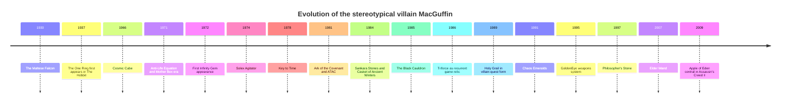
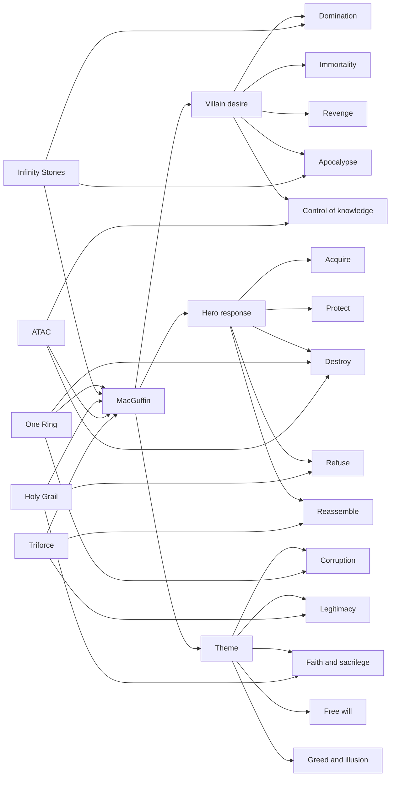

# Villain MacGuffins Across Popular Narrative

## Executive summary

A villain MacGuffin is the plot-driving object, device, relic, formula, or collectible that an antagonist wants badly enough to organize the story around it. In the lean Hitchcockian sense, the object mainly matters because characters pursue it; in modern franchise storytelling, however, the object often also carries real symbolic and moral weight. *The Maltese Falcon* sits near the “pure” end of the spectrum, because the statuette matters mostly as an obsession magnet, while the One Ring sits near the “thick” end, because its intrinsic corruptive power is inseparable from the plot. citeturn22search0turn26search0turn4search11

Across film, literature, TV, comics, and games, stereotypical villain MacGuffins cluster around four promises: dominion, immortality, revelation, and apocalypse. Their default forms are highly legible and easy to visualize—rings, gems, cups, wands, boxes, caskets, ancient books, or compact bits of “cold” technology—because they must be graspable in a single shot or line of dialogue. Even when their stakes are planetary or cosmic, they are usually portable, divisible, or activatable by a small cast, which makes them ideal engines for chases, heists, serialized collections, betrayals, and last-minute reversals. citeturn4search11turn3search0turn28search0turn28search5turn28search14turn31search1turn36search4

Genre changes the texture of the same basic device. Spy stories favor deliberately opaque technical MacGuffins like ATAC or the Solex Agitator; fantasy and myth prefer ancient relics such as the Grail, the Ring, or the Triforce; comics and science fiction scale the form up into universe-level abstractions such as the Infinity Stones or the Anti-Life Equation; and Japanese game and manga traditions often favor shard-sets or emblem-sets, such as the Triforce and Chaos Emeralds, over a single Western-style grail relic. For writers, the most durable lesson is simple: the best villain MacGuffin does two jobs at once—it moves the plot externally and reveals character internally. citeturn0search0turn0search1turn0search2turn14search0turn28search0turn28search14turn31search13turn36search4

## Scope and working definition

For this report, I treat a “villain MacGuffin” as a contested thing whose pursuit or activation by an antagonist materially structures the narrative. That includes sacred relics, magic items, super-science devices, weapon systems, formulas, and collectible sets. I also include several **quasi-MacGuffins**—objects that modern audiences do care about intrinsically—because contemporary franchise storytelling regularly departs from the stricter Hitchcock model. citeturn22search0turn26search0turn4search11

I prioritized canonical and official sources where they were readily available: publisher pages, studio/franchise pages, official comics/item pages, and official game portals. Where official sites did not expose enough bibliographic detail, I used high-quality reference sources such as *Britannica*. Dates below are **first notable appearance in the form most relevant to the villain-driven quest**, which sometimes means first publication and sometimes first adaptation. That is why the Grail is listed under *Indiana Jones and the Last Crusade* rather than medieval romance, and the Black Cauldron is listed in its Disney-film form here because that is the clearest studio-documented villain-MacGuffin instance. citeturn26search0turn14search0turn27search1

## Canonical catalog

| MacGuffin | Medium | First notable appearance | Brief description | Villain who sought it | Narrative function | Source |
| --- | --- | --- | --- | --- | --- | --- |
| The Maltese Falcon | Novel; later film | 1930 novel | A supposedly priceless black statuette whose rumored value sets criminals against one another. | Casper Gutman and rival crooks | Near-pure greed magnet; exposes duplicity more than power. | citeturn26search0 |
| Ark of the Covenant | Film | 1981, *Raiders of the Lost Ark* | Biblical relic believed to make armies invincible. | René Belloq and the Nazis | Sacred-object quest that fuses pulp action with divine terror. | citeturn13search0 |
| Sankara Stones | Film | 1984, *Indiana Jones and the Temple of Doom* | Sacred stones tied to cult power and ritual control. | Mola Ram | Ritualized power-object that localizes evil into a recoverable set. | citeturn14search1 |
| Holy Grail | Film | 1989, *Indiana Jones and the Last Crusade* | Cup conferring healing and life, but only under the right conditions. | Walter Donovan and his Nazi backers | Immortality MacGuffin that doubles as a moral test. | citeturn14search0 |
| Solex Agitator | Film | 1974, *The Man with the Golden Gun* | Solar-energy breakthrough with geopolitical and black-market value. | Francisco Scaramanga | Classic spy-tech prize: concrete enough to matter, vague enough to chase. | citeturn0search1turn0search9 |
| ATAC | Film | 1981, *For Your Eyes Only* | Automatic Targeting Attack Communicator retrieved from a sunken spy ship. | Aristotle Kristatos and Soviet interests | Command-device MacGuffin; pure race-to-recovery mechanics. | citeturn0search0 |
| GoldenEye weapons system | Film | 1995, *GoldenEye* | Satellite EMP weapon capable of catastrophic financial and infrastructural damage. | Alec Trevelyan, Ourumov, Xenia Onatopp | Non-portable apocalypse switch that drives infiltration and sabotage. | citeturn0search2turn0search13 |
| The One Ring | Literature; later film | 1937, *The Hobbit*; central in *The Lord of the Rings* | Sauron’s ruling ring, forged to dominate the other Rings and corrupt its bearers. | Sauron | The definitive corrupting power-object: the quest becomes renunciation, not possession. | citeturn4search2turn4search11turn4search1 |
| Philosopher’s Stone | Literature; later film | 1997 UK novel | Alchemical stone associated with transmutation and the elixir of life. | Voldemort through Quirrell | False-cure MacGuffin: desire for immortality reveals moral rot. | citeturn3search0turn2search0 |
| Elder Wand | Literature; later film | 2007, *Harry Potter and the Deathly Hallows* | Legendary “unbeatable” wand whose mastery transfers through defeat. | Voldemort | Mastery token that turns combat into a problem of legitimacy, not force. | citeturn35search0turn35search1 |
| The Black Cauldron | Film | 1985, *The Black Cauldron* | Mysterious cauldron whose power can unleash deathless warriors. | The Horned King | Necromantic apocalypse vessel; dark-fantasy siege engine. | citeturn27search1turn27search2turn27search11 |
| Infinity Stones | Comics; later film | 1972 onward, first gem in *Marvel Premiere* #1 | Six gems whose combined force can reshape reality itself. | Thanos and other cosmic antagonists | Ultimate fragmented-set MacGuffin; each acquisition escalates stakes. | citeturn28search0turn28search8turn28search16 |
| Cosmic Cube | Comics; later film analog as Tesseract | 1966, *Tales of Suspense* #79 | Reality-altering cube tied to A.I.M., Red Skull, and enormous psychic-spatial power. | Red Skull and A.I.M. | Portable omnipotence shortcut; compresses huge stakes into a hand-held object. | citeturn28search5turn28search1 |
| Anti-Life Equation | Comics | 1971, Fourth World era | Formula/power that can erase free will and subject sentient life to absolute control. | Darkseid | The MacGuffin abstracted into ideology: domination as theorem. | citeturn28search2turn28search14 |
| Mother Box | Comics; later animation/film | 1971, Fourth World / *Mister Miracle* era | Sentient New Gods technology capable of shielding, sensing, transferring energy, and opening Boom Tubes. | Frequently coveted or weaponized by Darkseid’s side | Techno-mythic quasi-MacGuffin: portable plot solution or threat multiplier. | citeturn29search12turn29search0 |
| The Key to Time | Television | 1978, *Doctor Who* Season 16 | Six disguised segments that, once assembled, can restore universal balance. | Multiple antagonists across the season; the Black Guardian lurks as the dark counterclaimant | Season-long scavenger-hunt MacGuffin. | citeturn1search2turn1search0 |
| Triforce | Games | 1986, *The Legend of Zelda* | Holy relic of Power, Wisdom, and Courage at the center of Hyrule’s recurring conflicts. | Ganon / Ganondorf | Mythic triadic relic that aligns moral qualities with possession. | citeturn31search13turn31search8turn31search2 |
| Chaos Emeralds | Games | 1991, *Sonic the Hedgehog* | Super-energy gemstones usable for weaponization or transformation. | Dr. Eggman | High-mobility collectible set; ideal for fast escalation and boss-gating. | citeturn36search4turn36search5 |
| Casket of Ancient Winters | Comics | 1984, *Thor* #348 | Asgardian artifact containing devastating winter-power. | Surtur; also wielded by Loki in later continuity | Catastrophe-in-a-box; activation is the threat. | citeturn33search17turn33search2turn33search13 |
| Apple of Eden | Games | 2009, centrally foregrounded in *Assassin’s Creed II* | Precursor artifact associated with control, knowledge, and manipulation across the franchise. | Templars, Al Mualim, Borgias, Abstergo factions | Conspiracy MacGuffin linking artifact power to historical control. | citeturn37search1turn37search8 |

## Comparative patterns

The strongest stereotypical villain MacGuffins promise one of four outcomes: rule others, outlive death, reveal hidden order, or trigger catastrophe. The Ring and Anti-Life Equation promise domination; the Philosopher’s Stone, Elder Wand, and Grail promise victory over mortality or weakness; Bond’s ATAC and Solex promise strategic leverage; and GoldenEye, the Black Cauldron, the Casket, and the Infinity Stones threaten escalating disaster when activated. The repetition matters: villain MacGuffins are typically not random valuables but compressed fantasies of asymmetrical advantage. citeturn4search11turn28search14turn3search0turn35search0turn0search0turn0search1turn0search2turn27search1turn33search17turn28search0

Aesthetically, the form is usually simple and mnemonic. Rings, stones, cups, wands, cubes, and caskets read immediately on screen and on covers; they can be held up, stolen, swapped, dropped, hidden, or assembled. That simplicity is not trivial. It lets the story move quickly from exposition to desire. Even the more technical examples—ATAC, the Solex Agitator, GoldenEye, or the Apple of Eden—are narratively treated as graspable tokens, not as fully explained systems. By contrast, non-portable MacGuffins like GoldenEye or the Anti-Life Equation require the plot to shift from “grab the object” to “reach the control point,” “prevent activation,” or “stop transmission.” citeturn0search0turn0search1turn0search2turn37search1turn28search14

The moral status of the MacGuffin is equally important. Some are basically neutral valuables, like the Falcon or spy-tech devices; some are sacred or conditional, like the Grail; and some are actively contaminating, like the One Ring. Modern popular storytelling strongly prefers the last two categories, because they let the object test the seeker rather than merely reward the winner. That is why so many memorable resolutions are not “hero acquires object” but “hero refuses object,” “object destroys unworthy claimant,” or “object must be destroyed, dispersed, or sealed.” The Ring is unmade, the Philosopher’s Stone is destroyed, the ATAC is destroyed, the Black Cauldron is neutralized, and the Elder Wand’s apparent “ownership” is exposed as unstable and rule-bound. citeturn26search0turn14search0turn4search11turn3search0turn0search0turn27search11turn35search0turn35search1

Plot-mechanically, the field breaks into a few reliable structures. A **single-object chase** favors falcons, cups, cubes, and command devices. A **serial collection quest** favors sets and fragments, such as the Infinity Stones, the Key to Time, or the Chaos Emeralds. A **heist/recovery structure** suits espionage objects like ATAC. A **destroy-don’t-use quest** suits morally toxic or totalizing artifacts like the Ring. And a **fakeout MacGuffin**—the Falcon remains the classic case—works by rerouting satisfaction away from acquisition and toward revelation of character. citeturn28search0turn1search2turn36search4turn0search0turn4search11turn26search0

## Genre and cultural variation

Spy stories prefer the “cold” MacGuffin: an opaque device or file whose technical detail is less important than who controls it. The Solex Agitator, ATAC, and GoldenEye all follow this logic. Their powers are legible at the level of stakes—energy, targeting, electromagnetic destruction—but not over-explained, which keeps attention on pursuit, betrayal, and access. In these stories, the villain MacGuffin is usually an auction item, control key, or strategic system rather than a morally enchanted relic. citeturn0search1turn0search9turn0search0turn0search2turn0search13

Fantasy, mythic adventure, and dark fantasy tend to do the opposite. Their MacGuffins are ancient, named, storied, and aesthetically overdetermined: the Ring, Grail, Ark, Cauldron, Philosopher’s Stone, Triforce. These objects practically demand lore. They also often carry built-in judgment: the Grail punishes the wrong choice, the Ring corrupts, the Arc destroys blasphemous claimants, and the Triforce aligns power with moral worth in a way technical devices do not. This is why fantasy villain MacGuffins often feel less like “plot excuse” and more like “portable metaphysics.” citeturn14search0turn13search0turn4search11turn27search1turn3search0turn31search13

Comics and science fiction scale the device upward. The Infinity Stones, Cosmic Cube, Anti-Life Equation, Mother Box, and Casket of Ancient Winters all preserve the legibility of the old relic form while inflating consequence to world, multiverse, or cosmic-system stakes. Their function is less “who gets rich?” and more “who rewrites reality, mobility, or freedom?” The superhero version of the villain MacGuffin therefore tends to be modular, serializable, and reboot-friendly: it can be hidden, split, retconned, recollected, or recontextualized without losing brand identity. citeturn28search0turn28search5turn28search14turn29search0turn33search17

Non-Western and Japanese popular narrative often favors shard-sets, emblems, or spiritually coded collectibles over the single grail-relic model. Nintendo’s official Zelda material frames the Triforce as the recurrent core of Link, Zelda, Ganondorf, and Hyrule’s long-running fate, while SEGA’s Sonic pages frame the Chaos Emeralds as super-energy gems that villains can weaponize and heroes can mobilize. A useful broader cultural backdrop is *Journey to the West*, which formalized a pilgrimage logic centered on sacred acquisition and quest progression; modern East Asian franchise storytelling frequently retools that structure into collectible-set storytelling rather than a one-off holy object. citeturn31search13turn31search1turn36search4turn36search5turn25search0turn25search2

Horror is comparatively underrepresented in the source-backed matrix below, but the pattern is still visible in dark-fantasy and apocalypse artifacts like the Black Cauldron and the Casket of Ancient Winters: activation itself is the curse. In horror-adjacent MacGuffins, the narrative reward for possession is often inverted—opening, summoning, reading, or assembling the object is what unleashes the threat. That inversion is one reason horror MacGuffins often feel sharper and meaner than adventure MacGuffins. citeturn27search1turn33search17

## Writer archetypes and subversions

The archetypes below are distilled from the canonical cases above rather than copied from any one franchise. They are useful because they separate the **plot function** of the MacGuffin from its surface dressing. The same engine can be reskinned as fantasy, spy, horror, superhero, historical thriller, or gameable quest structure. citeturn26search0turn4search11turn28search0turn0search0turn31search13

| Archetype | Core function | Adapt prompt | Subvert prompt |
| --- | --- | --- | --- |
| The ruling relic | Gives one claimant asymmetrical control over others | “A conqueror seeks an heirloom that can override loyalty at scale.” | “The relic cannot control strangers; it only magnifies obedience already freely given.” |
| The false cure | Promises immortality, healing, or restoration | “A dying tyrant hunts the only object that can keep them alive one more year.” | “The cure works, but only if the seeker relinquishes the thing they most want to preserve.” |
| The apocalypse switch | Small object, enormous consequences | “A compact key can wake a dormant planetary defense network.” | “Everyone thinks it is a weapon; it is actually the only shutdown device.” |
| The fragmented set | Serial quest built from pieces, stones, shards, or segments | “Each fragment unlocks a new layer of the villain’s plan and a new type of set piece.” | “The final fragment belongs to someone who values incompletion more than power.” |
| The sacred test object | Object judges worthiness, not just possession | “A holy vessel can heal the land but kills the unworthy ruler who claims it.” | “The ‘test’ turns out to measure compassion, not bloodline or purity.” |
| The cold device | Technical object with legible stakes but opaque mechanism | “Intelligence agencies race for a targeter, core, chip, or communicator.” | “The device’s true value is diplomatic leverage, not its engineering.” |
| The mastery token | Ownership depends on rules of succession, duel, or lineage | “The villain wins every fight but still cannot truly own the object.” | “Mercy, surrender, or self-sacrifice—not conquest—transfers legitimacy.” |
| The counterfeit prize | Desire matters more than authenticity | “Gangsters kill for an artifact that proves to be fake.” | “The fake is worthless materially but authenticates a hidden inheritance, map, or witness.” |

What makes the best subversions work is that they move the audience’s attention from **what the object does** to **what desiring it does to characters**. The canonical playbook is remarkably consistent: the Falcon is fake, so obsession becomes the point; the Ring and Stone must be destroyed or refused, so restraint becomes the point; the Key to Time and Infinity Stones fragment the object, so process becomes the point; and the Anti-Life Equation turns the MacGuffin into a formula of tyranny, so ideology becomes the point. In each case, the story gets stronger when possession stops being a simple win condition. citeturn26search0turn4search11turn3search0turn1search2turn28search0turn28search14

## Attribute matrix

The matrix below compares the **same top twenty cases** on a set of writer-facing attributes. Several columns—especially “moral cost” and “resolution type”—are analytical syntheses rather than explicit canonical labels, so read them as interpretive summaries grounded in the catalog above. That synthesis is chiefly derived from the official franchise pages and reference sources already cited for Bond, Indiana Jones, Tolkien, Rowling, Marvel, DC, Nintendo, SEGA, *Doctor Who*, Disney, and Ubisoft. citeturn0search0turn13search0turn4search11turn35search0turn28search0turn28search14turn31search13turn36search4turn37search1

| MacGuffin | Origin | Power type | Stakes | Portability | Moral cost | Resolution type |
| --- | --- | --- | --- | --- | --- | --- |
| The Maltese Falcon | Secular art-treasure legend | Status / wealth | Criminal-local | Hand-held | Low intrinsic cost; high greed cost | Revealed fake |
| Ark of the Covenant | Biblical relic | Divine annihilation | Military / civilizational | Portable chest | Extreme sacrilege risk | Unleashed, then removed |
| Sankara Stones | Sacred stones | Ritual / cultic-spiritual force | Regional / communal | Pocket-size set | Sacrificial cult cost | Restored / returned |
| Holy Grail | Sacred vessel | Healing / life extension | Personal, dynastic, spiritual | Portable but site-bound in practice | Worthiness test | Hidden / left behind |
| Solex Agitator | Scientific prototype | Energy leverage | Geopolitical | Hand-held | Commodifies crisis | Seized / neutralized |
| ATAC | Military command device | Strategic weapons control | Geopolitical | Hand-held | Betrayal and espionage cost | Destroyed |
| GoldenEye system | Orbital weapons platform | EMP mass destruction | National / systemic | Non-portable system | Revenge-terror logic | Facility destroyed |
| One Ring | Forged dark relic | Dominion / corruption | World-historic | Ultra-portable | Extreme corruption | Unmade |
| Philosopher’s Stone | Alchemical artifact | Wealth + immortality | Personal immortality | Portable | Deathlessness temptation | Destroyed |
| Elder Wand | Legendary mastery token | Duel supremacy / magical mastery | War / succession | Portable | Violent transfer rules | Mastery recontextualized |
| Black Cauldron | Necromantic vessel | Undead army creation | Kingdom / army | Portable with effort | Sacrifice and horror cost | Neutralized at cost |
| Infinity Stones | Cosmic gem-set | Reality rewriting | Universal | Portable individually, dangerous collectively | Absolute-power hubris | Assembled, then dispersed |
| Cosmic Cube | Super-science / cosmic artifact | Reality warp | National to cosmic | Portable | Megalomania / instability | Contained, shattered, or lost |
| Anti-Life Equation | Metaphysical formula | Free-will erasure | Universal | Abstract / transmissible | Total tyranny | Prevented / sealed |
| Mother Box | Sentient super-tech | Travel, shields, energy, intelligence | Tactical to planetary | Hand-held | Alignment-dependent | Reclaimed / redirected |
| Key to Time | Cosmic key fragments | Universal balance / order | Cosmic | Fragmented portable pieces | Misuse of order/control | Assembled, then dispersed |
| Triforce | Holy relic | Wish / virtue-linked power | Kingdom to cosmic | Symbolically divisible | Unworthy-use distortion | Rebalanced / re-split |
| Chaos Emeralds | Super-energy gems | Transformation / machine power | City to world | Portable set | Easy weaponization | Scattered / recollected |
| Casket of Ancient Winters | Asgardian relic | Climate apocalypse | Realm / world | Hand-sized | Uncontrollable release | Broken, sealed, or reclaimed |
| Apple of Eden | Precursor artifact | Control / illusion / knowledge manipulation | Civilizational | Portable orb | Authoritarian manipulation | Hidden / cyclically contested |

## Visual references and mermaid diagrams

For quick official visual reference pages, the most useful starting points are Lucasfilm’s *Raiders*, *Temple of Doom*, and *Last Crusade* pages; Marvel’s official Infinity Stones and Cosmic Cube pages; DC’s Darkseid page; Nintendo’s Zelda portal and online guide; SEGA’s Sonic Channel pages for *Sonic the Hedgehog* and *Sonic Adventure*; Disney’s *Black Cauldron* and D23 Horned King entries; and the official *Doctor Who* story pages for *The Ribos Operation* and *The Armageddon Factor*. Those pages are the easiest click-through image-and-lore anchors for the central cases discussed here. citeturn13search0turn14search0turn14search1turn28search4turn28search5turn28search2turn31search0turn31search1turn36search4turn30search2turn27search1turn27search2turn1search2turn1search0

A timeline diagram is most useful if it emphasizes **evolution of form**, not just chronology: from greed-objects, to sacred relics, to command devices, to fragmented sets, to ideological formulas and franchise mega-artifacts. That arc is well supported by the canonical examples in the catalog. citeturn26search0turn4search2turn28search5turn28search0turn28search14turn31search13turn36search4

An entity-relationship diagram is most useful if it maps how the object links **villains**, **heroes**, and **themes** rather than treating the item as a mere prop. That is the central analytic finding of this report: the most memorable MacGuffins are character machines. citeturn26search0turn4search11turn3search0turn28search14turn31search13

## Open questions and limitations

This is a **canonical, high-confidence** map rather than an exhaustive encyclopedia. I favored objects with strong official or reference support and with clear villain pursuit, which means I excluded many smaller TV episode MacGuffins, anime-only one-offs, and region-specific examples that absolutely exist but were less cleanly sourceable in official venues.

A few entries are better understood as **quasi-MacGuffins** than as pure Hitchcockian MacGuffins—especially the One Ring, Anti-Life Equation, Mother Box, and Triforce—because the object’s intrinsic meaning is as important as the chase. That is not a defect; it is arguably the modern norm. citeturn22search0turn4search11turn28search14turn29search0turn31search13

Two notable gaps deserve to be explicit. First, horror is analytically present here mostly through dark-fantasy and catastrophe artifacts, not through a fuller horror-specific matrix. Second, for older literary works and long-running franchises, “first notable appearance” can mean first publication, first adaptation, or first moment of unmistakable villain-centered centrality. I used the version that best matched the villain-MacGuffin function, but another reasonable report could normalize those dates differently.